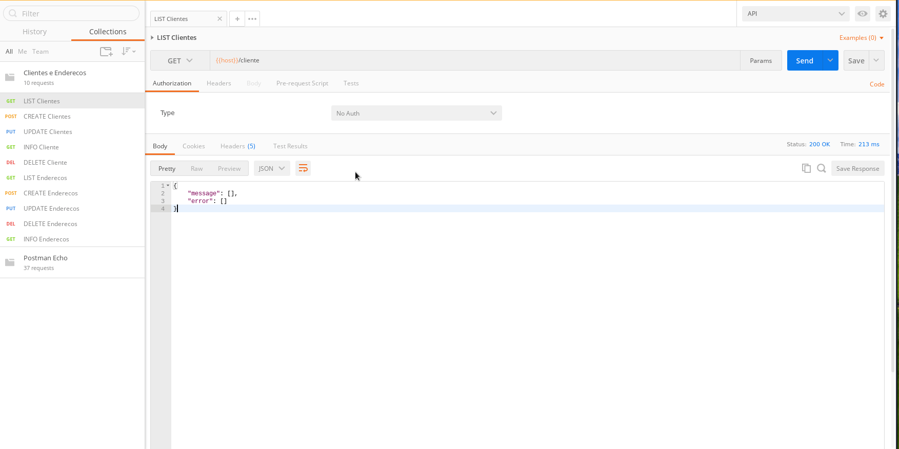
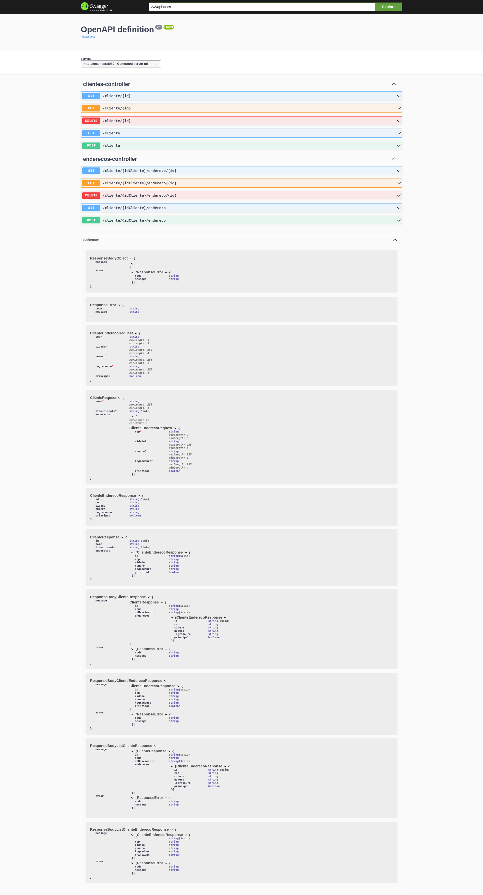

[](https://heroku.com/deploy/?template=https://github.com/gilberto-009199/athornatus_vaga) [](https://gitpod.io#https://github.com/gilberto-009199/athornatus_vaga)


# Desafio Java
[](https://github.com/gilberto-009199/athornatus_vaga/actions/workflows/test.yml)




Backend com API simples para gerenciar Pessoas e Endereços. Usando **SpringBoot**, **Swagger**, **Lombok** e **Docker**.

### How Run:
#### Docker:
```shell
$ docker compose up
```
#### Maven:
```shell
$ ./mvnw clean package
```

## Links
- [Execução](#execução)
- [Status](#status)
- [Documentação Swagger](#links-da-documenta%C3%A7%C3%A3o)


## Descrição
Usando Spring boot, crie uma API simples para gerenciar Pessoas. Esta API deve permitir:
+ Criar uma pessoa
+ Editar uma pessoa
+ Consultar uma pessoa
+ Listar pessoas
+ Criar endereço para pessoa
+ Listar endereços da pessoa
+ Poder informar qual endereço é o principal da pessoa  

Uma Pessoa deve ter os seguintes campos:
+ Nome
+ Data de nascimento
+ Endereço:
    + Logradouro
    + CEP
    + Número
    + Cidade

## Status

| Feature                  | Status          |
|--------------------------|-----------------|
| API                      | :green_circle:  |
| API Documentação Swagger | :green_circle:  |
| Banco de Dados           | :green_circle:  |
| Docker                   | :green_circle:  |
| Log's                    | :green_circle:  |
| Tests da API             | :green_circle:  |
|  Tests dos Services      | :green_circle:  |


### Consumindo API
  Os links para os arquivos de configuração então abaixo:

  * [DOWNLOAD POSTMAN Collection](https://raw.githubusercontent.com/gilberto-009199/athornatus_vaga/main/rest.postman_collection.json) - Postman Collection para consumir a API 
  * [DOWNLOAD POSTMAN Environment Collection](https://raw.githubusercontent.com/gilberto-009199/athornatus_vaga/main/environment.postman_environment.json) - Postman  Environment Collection para consumir a API

<video src="https://user-images.githubusercontent.com/38070920/211644548-442c0f45-90d1-493f-8171-72227d68f2d5.mp4"></video>

## Bibliotecas

* [SpringBoot](https://spring.io) - Plataforma para desenvolvimento web em java
* [Swagger](https://swagger.io/) - Biblioteca para documentação de API
* [Lombok](https://projectlombok.org) - Biblioteca para agilizar a codificação em Java
* [H2](https://www.h2database.com) - Sistema de gerenciamento de banco de dados relacional escrito em Java.
* [ModelMapper](https://modelmapper.org/) - Biblioteca para agilizar o mapeamento de objetos(DTO, Entity, Request, Response)

# Links da Documentação


* [Documentacao swagger JSON](https://raw.githubusercontent.com/gilberto-009199/athornatus_vaga/main/api-docs.json) - Arquivo de Documentacao em JSON
* [Documentacao swagger YAML](https://raw.githubusercontent.com/gilberto-009199/athornatus_vaga/main/api-docs.yaml) - Arquivo de Documentacao em YAML



